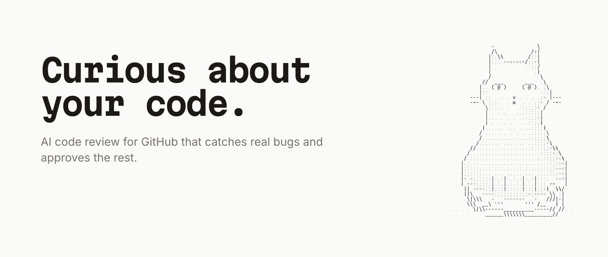

# Hansi

[hansi.codes](https://hansi.codes) · Named after Hansi, the cat.

<picture>
  <source media="(prefers-color-scheme: dark)" srcset=".github/assets/hero-dark.png">
  
</picture>

Hansi reviews your GitHub pull requests like a careful teammate: it points out real bugs, stays
quiet about style, and approves the rest. It runs on your own model key from OpenAI, Anthropic,
Amazon Bedrock, Google, xAI, OpenRouter, or any OpenAI-compatible endpoint.

**Use it** at [hansi.codes](https://hansi.codes), free during the beta, or
**[host it yourself](SELFHOST.md)**. Hansi is MIT-licensed and runs as a single Docker image.

## How it works

1. Install the GitHub App on your repositories and add a model key.
2. When a pull request is opened or updated, Hansi checks out the code and explores the repository
   the way a reviewer would: it reads files, searches for usages, and follows the change.
3. A second, skeptical pass double-checks every finding. Only the ones that hold up are posted, as
   inline comments with a suggested fix when there is one.
4. Hansi submits a real review, **Approve** or **Request changes**, and grades the pull request
   from **S** (ready to merge) to **F** (do not merge) in one summary comment that it keeps up to
   date.
5. After a fix is pushed, it reviews only what changed, resolves the threads of the findings that
   are fixed, and approves once nothing blocking is left.

Reply to any of its comments, or mention the app with a question, and Hansi answers in the thread.
Tell it "we don't flag this in tests" and it remembers for future reviews.

## Why Hansi

- **Few comments, all worth reading.** By default Hansi only flags obvious mistakes, the kind you'd
  agree with at a glance. Most good pull requests get an approval and no comments at all.
- **A reviewer, not a bot.** It approves and requests changes like a teammate, and its check run
  can gate merges.
- **Your model, your bill.** You pay your provider directly, and the dashboard shows the tokens and
  cost of every review, by model and by repository.
- **Transparent.** Every review records which files the agent read, what it searched for, and which
  findings were dropped and why.
- **Hard to talk into approving.** Everything in a pull request is treated as untrusted. Settings
  come from the base branch, and pull requests from people without write access are never approved
  automatically.

## Repository configuration

Add `.hansi.json` to the repository root. The `$schema` line gives you autocompletion and
validation in editors like VS Code. Schemas are versioned: `schema/v1.json` never changes, and
`https://hansi.codes/schema.json` always serves the latest version. Hansi also reads `AGENTS.md`, `CLAUDE.md`, `.cursorrules`, and
`.github/copilot-instructions.md` as review guidelines. Both come from the pull request's base
branch, so changes take effect once they are merged. Every field is optional:

```json
{
	"$schema": "https://hansi.codes/schema/v1.json",
	"reviews": {
		"enabled": true,
		"auto": true,
		"drafts": false,
		"baseBranches": [],
		"pathFilters": ["!docs/**", "!**/*.snap"],
		"profile": "chill",
		"minSeverity": "minor",
		"maxComments": 15,
		"approve": true,
		"requestChanges": "major",
		"approveOutsideContributors": false
	},
	"instructions": "We use Result types instead of exceptions in src/domain.",
	"pathInstructions": [
		{ "path": "migrations/**", "instructions": "Check that every migration is reversible." }
	],
	"language": "en"
}
```

| Field                                | Default | What it does                                                                        |
| ------------------------------------ | ------- | ----------------------------------------------------------------------------------- |
| `reviews.enabled`                    | `true`  | Review pull requests in this repository.                                            |
| `reviews.auto`                       | `true`  | Review when a pull request is opened or updated. Mentions always work.              |
| `reviews.drafts`                     | `false` | Also review draft pull requests.                                                    |
| `reviews.baseBranches`               | `[]`    | Only review pull requests into these branches. Empty means all.                     |
| `reviews.pathFilters`                | `[]`    | Globs for the files to review; prefix with `!` to exclude.                          |
| `reviews.profile`                    | `chill` | `chill` flags obvious mistakes only; `balanced` and `strict` dig deeper.            |
| `reviews.minSeverity`                | `minor` | Findings below this severity (`info`, `minor`, `major`, `critical`) are not posted. |
| `reviews.maxComments`                | `15`    | The most inline comments in one review.                                             |
| `reviews.approve`                    | `true`  | Approve pull requests without blocking findings.                                    |
| `reviews.requestChanges`             | `major` | Severity from which Hansi requests changes; `never` to only comment.                |
| `reviews.approveOutsideContributors` | `false` | Approve pull requests from people without write access.                             |
| `instructions`                       | `""`    | Extra review instructions for the repository.                                       |
| `pathInstructions`                   | `[]`    | Instructions for files matching a glob.                                             |
| `language`                           | `en`    | Language for review comments.                                                       |

### Verdicts and tiers

Each review is submitted to GitHub as **Approve**, **Request changes**, or **Comment**:

- New findings at or above `requestChanges`: **Request changes**.
- Blocking findings from an earlier review still open: **Comment**, so the earlier request for
  changes stays in effect until they are fixed or dismissed in the thread.
- Otherwise: **Approve** (minor findings are still posted as comments), unless `approve: false`.

The tier grades merge confidence:

| Tier | Meaning                     |
| ---- | --------------------------- |
| S    | Ready to merge              |
| A    | Mergeable after minor fixes |
| B    | Needs changes               |
| C    | Significant problems        |
| D    | Serious problems            |
| F    | Do not merge                |

The model grades the pull request, but open findings cap the tier: a minor finding means at most
**A**, a major one at most **B**, a critical one at most **D**. Informational notes don't lower it.
The `Hansi` check run follows the verdict (success, failure, or neutral), so you can make it a
required check.

## Development

Requires [Bun](https://bun.sh) 1.4 or later, `git`, and
[`ripgrep`](https://github.com/BurntSushi/ripgrep). No Docker needed: the database is a local
libSQL file (`data/hans.db`).

```sh
bun install
cp .env.example .env   # fill in HANS_ENCRYPTION_KEY and BETTER_AUTH_SECRET
bun run dev            # migrates, then starts the web app and worker
```

GitHub must be able to reach your webhook URL. Run a tunnel such as
`cloudflared tunnel --url http://localhost:5173`, set `APP_URL` to its address, then open
`APP_URL/setup` to create a GitHub App for development.

| Command               | What it does                                                 |
| --------------------- | ------------------------------------------------------------ |
| `bun run dev`         | Web app and worker with live logs                            |
| `bun run check`       | Type-check every package                                     |
| `bun run test`        | Unit and integration tests (in-memory libSQL, mocked models) |
| `bun run lint`        | Prettier and ESLint                                          |
| `bun run build`       | Production build of the web app                              |
| `bun run eval`        | Score review quality with a real model                       |
| `bun run db:generate` | Generate a migration after changing `packages/db/src/schema` |

### Evals

`packages/evals` measures review quality on small pull requests with known bugs (TypeScript,
Python, Go), and on clean changes where any comment is noise. It builds a real git repository for
each case, runs the review engine, and reports precision, recall, F1, and cost:

```sh
EVAL_PROVIDER=anthropic EVAL_MODEL=<model id> EVAL_API_KEY=… bun run eval
bun run eval -- --case sql --repeat 3 --min-f1 0.6
```

Run it before and after changing prompts or models, and add a case to `packages/evals/src/cases`
for every bug Hansi should have caught. The `Evals` workflow runs the suite on demand, or on pull
requests labeled `run-evals`.

### Architecture

```
GitHub ──webhook──► web (SvelteKit + Hono at /api) ──► libSQL ◄── worker ──► model provider
                        dashboard, auth, setup           jobs      clone, review, post
```

| Path              | Purpose                                                                  |
| ----------------- | ------------------------------------------------------------------------ |
| `apps/web`        | SvelteKit dashboard; Hono mounted at `/api` for auth, webhooks, and API  |
| `apps/worker`     | Claims review jobs, checks out the PR, runs the engine, posts the review |
| `packages/core`   | Review engine: diff parsing, filters, agent tools, review and verify     |
| `packages/db`     | Drizzle schema and migrations for libSQL                                 |
| `packages/queue`  | Durable job queue on the same database (leases, retries, singletons)     |
| `packages/llm`    | Provider registry, key encryption, model listing, models.dev pricing     |
| `packages/github` | GitHub App auth, manifest flow, pull request and check run helpers       |
| `packages/config` | Environment and `.hansi.json` schemas                                    |
| `packages/evals`  | Review-quality benchmark: cases with known bugs, scoring, runner         |

### Security model

- The agent can only read and search the checkout; it never runs repository code.
- Pull request content is treated as untrusted input that may try to steer the model, so approvals
  are guarded outside the model:
  - `.hansi.json` and guideline files come from the base branch;
  - pull requests from people without write access are never approved automatically;
  - a review that could not see the whole diff never approves.
- Provider keys and GitHub App secrets are encrypted with AES-256-GCM using `HANS_ENCRYPTION_KEY`.
- Webhooks are signature-verified and deduplicated.
- Only owners, members, and collaborators can trigger reviews or answers by mention, since each
  one spends your API credits.

## License

[MIT](LICENSE)
